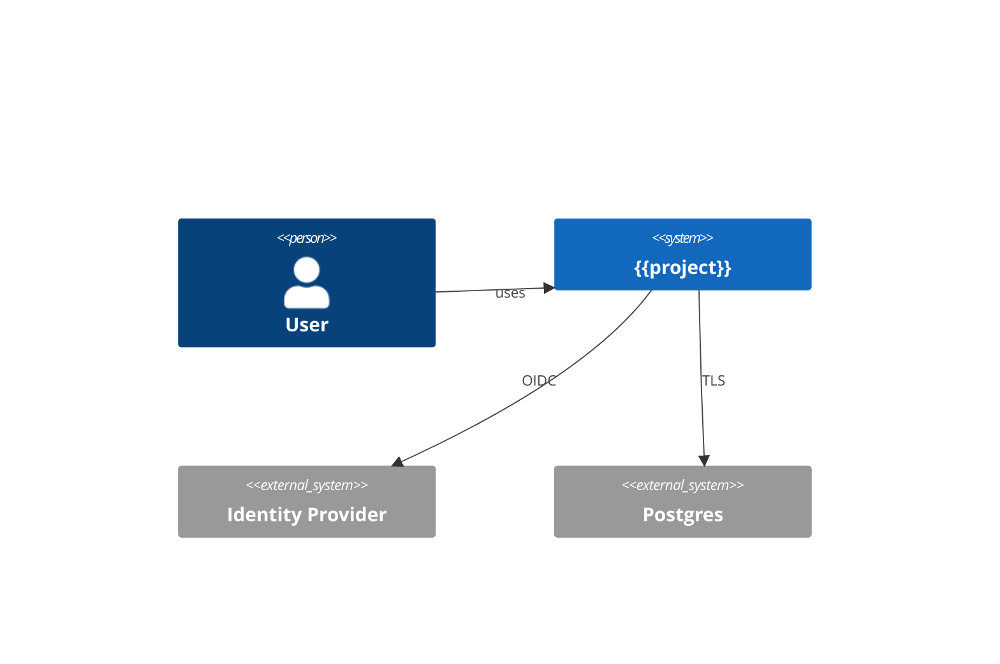

# ARCHITECTURE.md template

```markdown
# Architecture, {{project-name}}

> Last updated: {{date}}. This file describes the *current* architecture, not the aspirational one. Roadmap items belong in ROADMAP.md.

## 1. Context (why this exists)

One paragraph. What problem the system solves; what the boundary is; what's explicitly out of scope.

## 2. System diagram

(Mermaid C4-Context preferred for ≥3 components; ASCII for simple cases.)



## 3. Component diagram

(Mermaid C4-Container or component-level. Identify processes, data stores, integration points. Mark trust boundaries.)

## 4. Module decomposition

Per Parnas (1972): modules hide *design decisions likely to change*, not flow steps.

| Module | Hidden decision | Stable interface |
|---|---|---|
| `core/` | domain rules; can be reimplemented in another language | input/output contracts (Pydantic / Zod) |
| `api/` | HTTP framework choice | OpenAPI spec |
| `db/` | ORM / SQL choice | repository interfaces |
| `llm_client/` | provider + model choice (if LLM-bearing) | Protocol / Interface |

## 5. Data model

(High-level. ER diagram or table list. Reference migration history in `db/migrations/` for detail.)

## 6. Cross-cutting concerns

- **Authentication**: {{OIDC / API keys / mTLS}}
- **Authorization**: {{RBAC via {{policy engine}} / row-level security}}
- **Observability**: {{tracing tool, metrics tool, log aggregator}}
- **Configuration**: {{12-factor env / K8s ConfigMap / SOPS-encrypted}}
- **Secrets**: {{Vault / KMS / Cloud Secrets Manager}}
- **Resilience**: {{retry policy, circuit breaker, idempotency-key, timeout defaults}}
- **Concurrency model**: {{language-native; reference per-language file}}

## 7. Architectural fitness functions

See `checklists/fitness_functions.md`.

| Function | Enforces ADR | Runs |
|---|---|---|
| `tools/check_module_boundaries.{{ext}}` | `0007-module-boundaries` | pre-commit + CI |
| `tools/check_changelog.sh` | `0012-keep-changelog` | CI on PR |
| `tools/check_api_inventory.sh` | `0009-public-api-inventory` | CI nightly |

## 8. Active ADRs

Decisions of record in `docs/adr/`:

| # | Title | Status | Date |
|---|---|---|---|
| 0001 | {{decision}} | accepted | {{date}} |
| 0002 | {{decision}} | superseded by 0007 | {{date}} |

## 9. Trade-offs and known limitations

(Plain language. What this design is bad at. When to revisit.)

- {{limit}}: {{revisit trigger}}
- {{trade-off}}: {{why we accept it}}

## 10. Operational properties

- **Deployment model**: {{single PaaS / multi-region / on-prem}}
- **Failure modes**: {{listed; with mitigation}}
- **SLO targets**: {{p99 latency, error budget, availability}}
- **Capacity baseline**: {{measured at {{date}}}}

## 11. Security architecture

Cross-link `SECURITY.md`, `docs/threat-model.md`. Summary here:
- TLS, mTLS where, encryption at rest scope, secret management, audit log

## 12. Future direction (read-only, full plan in ROADMAP.md)

Pointer to roadmap. Do not duplicate.
```
