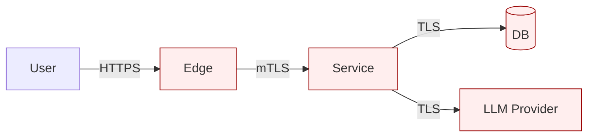

# Threat Model, {{Project / Feature Name}}

> Process: [STRIDE](../checklists/threat_model_stride.md) for security; [LINDDUN](../checklists/threat_model_linddun.md) for privacy. Walk both for any change touching personal data.

## 1. Scope

- **Feature / change**: {{description}}
- **Trust boundaries**: {{list, e.g. browser↔server, server↔db, client↔third-party API}}
- **Data classes** (mark all that apply): public / internal / confidential / PII / PHI / PCI / NPI / regulated
- **Regulatory anchors**: {{GDPR / CCPA / HIPAA / PCI-DSS / SOC2 / ISO 27001 / FedRAMP / none}}

## 2. Data-flow diagram

(ASCII or Mermaid. Identify processes, data stores, data flows, trust boundaries.)

## 3. STRIDE walk (per boundary crossing)

| Boundary | S | T | R | I | D | E |
|---|---|---|---|---|---|---|
| user → edge | OIDC; HSTS | TLS; HSTS preload | per-request audit | TLS; structured errors | rate limit; body size | least-priv role |
| edge → svc | mTLS | TLS | request ID logged | structured errors | timeout | least-priv |
| svc → db | service identity | TLS to DB | append-only audit-log | row-level security | timeout; query budget | least-priv DB role |
| svc → llm | provider auth | TLS | per-tenant request log | output redaction | timeout; rate limit | tier-allowlist on tools |

## 4. LINDDUN walk (per personal-data flow)

(Only if personal data flows through the boundary.)

| Flow | Linkability | Identifiability | Non-repudiation | Detectability | Disclosure | Unawareness | Non-compliance |
|---|---|---|---|---|---|---|---|
| user.email → analytics | per-context pseudonym | k≥5 generalization | (n/a) | padded responses | encryption at rest | privacy notice + just-in-time consent | GDPR Art 6 lawful basis recorded |

## 5. Findings

| ID | Category | Threat | Impact | Mitigation in place / planned | Test that catches regression |
|---|---|---|---|---|---|
| T-01 | STRIDE-T | TLS cert pinning absent | data tamper | issue cert; cert-rotation runbook | integration test on cert rotation |
| P-01 | LINDDUN-I | quasi-id leakage in analytics export | re-identification of subset users | k-anonymity check on export | unit test asserts k≥5 |

## 6. Open questions

- {{question}}, owner / due date

## 7. Sign-off

- Author: {{name}} • Date: {{date}}
- Reviewer: {{name}} • Date: {{date}}
- DPO / Privacy review (if PII): {{name}} • Date: {{date}}

## 8. Re-review trigger

This threat model is reviewed when:
- New trust boundary added (new dep / new API / new data flow)
- Regulatory landscape changes (new applicable law / standard)
- A reported incident touches a flow in this model
- Annual review (per ISO 27001 / SOC2 cadence if applicable)
