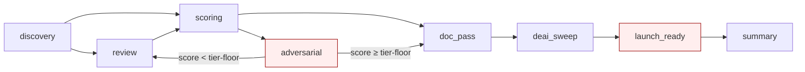

# Codeit Workflow — DAG (canonical)

The recovery engagement is a DAG, not a waterfall. This is the **single source of truth**; SKILL.md and other workflow files reference by phase ID.

## DAG diagram



## Phase activation criteria

| Phase ID | Activation | Required inputs | Output |
|---|---|---|---|
| `discovery` | always | engagement type + project path | `.recovery/discovery.md` |
| `review` | if `existing_code_path` provided | discovery output | `.recovery/review.md` (P0/P1/P2 findings) |
| `scoring` | always | review or planning artifact | `.recovery/scoring.md` (per-change rows + engagement aggregate) |
| `doc-pass` | if `writes_code` OR `writes_docs` | scoring output | doc deltas |
| `deAI-sweep` | if `writes_docs` | doc-pass output | sweep report + sed-style fixes |
| `adversarial` | if engagement-aggregate < tier_threshold | scoring output | escalation: re-loop review or escalate to user |
| `launch-ready` | if `engagement_type == "harden"` | all prior phases pass | `.recovery/launch_ready.md` (DoD walked) |
| `summary` | always | all phase outputs | `.recovery/summary.md` (one-page) |

## Edge predicates

Edges (per diagram):

| Edge | Predicate |
|---|---|
| `discovery → review` | engagement reads existing code |
| `discovery → scoring` | engagement always scores (planning or review feeds it) |
| `review → scoring` | findings produced |
| `scoring → adversarial` | engagement-aggregate < tier_threshold |
| `adversarial → review` | adversarial questions surfaced new finding (re-review) |
| `adversarial → doc_pass` | adversarial passed; aggregate ≥ threshold |
| `scoring → doc_pass` | aggregate ≥ threshold without adversarial loop |
| `doc_pass → deAI_sweep` | doc artifacts written |
| `deAI_sweep → launch_ready` | engagement is `harden`-typed |
| `deAI_sweep → summary` | engagement is not `harden`-typed |
| `launch_ready → summary` | DoD walked |

## Loop limits

`adversarial → review` loops at most twice. After 2 unsuccessful loops, escalate to user with a structured gap report. **No third silent loop** — the rubric's anti-gaming rule forbids.

## Per-phase verdict rows (.recovery/state.jsonl)

Schema:

```json
{
  "phase": "scoring",
  "ts": "2026-05-14T19:24:00Z",
  "verdict": "pass | fail | advisory | aborted",
  "score": 92,
  "tier": "vibe-careful",
  "artifacts": [".recovery/scoring.md"],
  "duration_seconds": 1234,
  "notes": "..."
}
```

One row per phase per run. Append-only.

## Idempotency

Re-running recovery on the same project:
1. Reads existing `.recovery/state.jsonl`.
2. Skips phases whose inputs haven't changed (file hashes recorded in state).
3. Re-runs phases whose inputs changed.

Force-re-run via `--rerun=phase[,phase,...]` flag.

## Abort protocol

At any phase, if abort triggered (user signal, scope mismatch, time exhaustion, security concern):

1. Write final `aborted` row to `state.jsonl`
2. Save partial state to `.recovery/abort-<ts>/`
3. Emit `.recovery/abort-<ts>/summary.md` with: phases completed, phases skipped, uncommitted-change disposition, what's next
4. Exit with non-zero structured verdict
5. Do not auto-cleanup — user owns disposition

## Cross-references

- Per-phase prompt details: `phase_prompts.md`
- Adversarial questions: `adversarial_questions.md`
- Engagement-level rubric: `../rubrics/code_fixer_confidence.md`
- Per-change rubric: `form-check.skill/rubrics/confidence_score.md`
- Launch-ready DoD: `../checklists/launch_ready.md`

## Anti-patterns

- Treating the DAG as a waterfall (running every phase always).
- Looping adversarial more than twice silently.
- Skipping `discovery` because "it's just a small change" — discovery is cheap and prevents larger waste.
- Re-running entire workflow when only one phase needs re-run — use `--rerun=phase`.
- Running `launch_ready` for a non-`harden` engagement — confuses DoD with general scoring.
